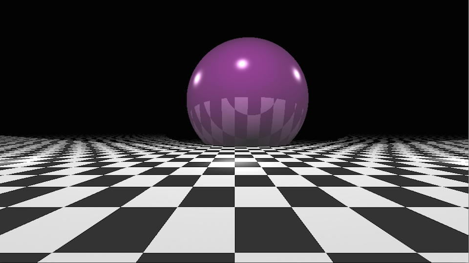

# raytracer
A basic plain C raytracer engine.



## Install
This ray tracer uses Minilibx graphic library: an opensource, didactic-purpose oriented library (included in the repository).
You need a xServer to run the program. For Mac OSX, please see [XQuartz](http://xquartz.macosforge.org/landing/).

```
Usage: ./rt [scene description file]
```

In the "scenes" folder you can find some scene-description file to test the raytracer.

Exemple:
```
./rt scenes/06_reflex_chessboard
```
